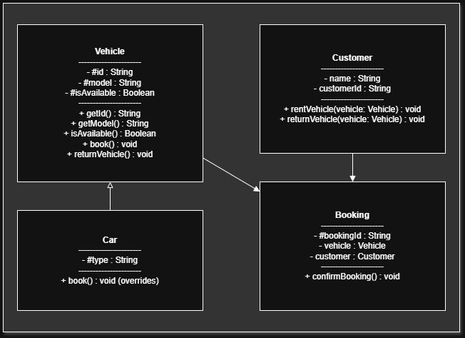

## Title:
Vehicle Booking System

## Description:
This system allows users to view available vehicles and make bookings for a specific duration. It helps track vehicle availability and manage reservations efficiently. It is used by customers and administrators in a vehicle rental business.

## UML Diagram
